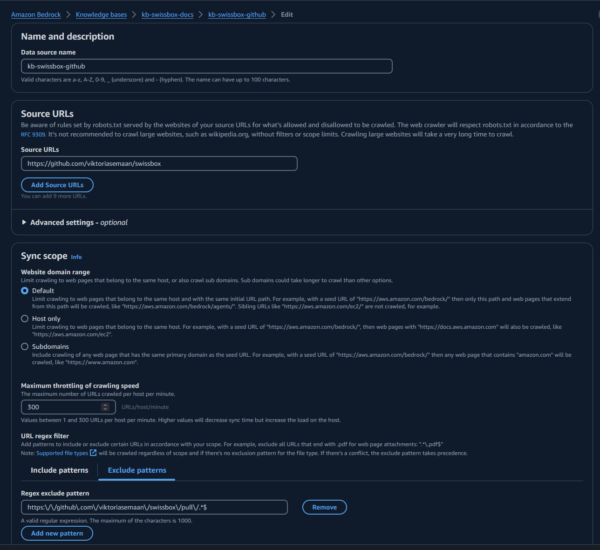

# Building AI Assitants with Amazon Bedrock Agents

Welcome to this repository on building Generative AI Agents using Amazon Bedrock!


In fast-paced technical roles like Solutions Architects and Cloud Engineers, we often face repetitive, time-consuming tasks that take us away from more impactful work. In this tutorial we weill help a fictional company SwissBox to build analytics solution. 

SwissBox is a tech company providing file-sharing services, approaches us for technical guidance on integrating analytics into their app, but the process can be tedious! We need to research their application architecture, security requirements, and AWS best practices, all while navigating over 200+ AWS services to find the right solution. This back-and-forth process consumes valuable time, delaying critical business outcomes.

<div align="center">
    
</div>

Imagine if we could automate these tasks using AI agents? Instead of spending days gathering information and building prototypes, AI agents could retrieve relevant data, generate infrastructure as code, and even provide cost estimates in seconds.

<div align="center">
    
</div>

This repository demonstrates how to build such AI agents using Amazon Bedrock, empowering you to streamline your workflow and focus on strategic work that drives business results.

## Solutions Included:

1. **Tool 1** - Q&A ChatBot utilizing Knowledge Bases for Amazon Bedrock
   - Build a Solutions Architect Q&A assistant to quickly retrieve relevant information from custom data sources like documentation, code repositories, and configurations.
   
2. **Tool 2** - Generate IaC using Claude 3.5 Sonnet
   - Create a DevOps assistant that generates Infrastructure as Code (IaC) using Claude 3.5, allowing for rapid deployment of cloud infrastructure.

3. **Tool 3** - Estimate costs using InfraCost
   - Develop a Financial Analyst assistant to estimate the costs of your proposed cloud solutions, helping you make informed financial decisions.

4. **Integrate Tools** - Build AI Agent using Amazon Bedrock
   - Combine the capabilities of all three tools into a single AI agent that can query enterprise documentation, suggest AWS solutions, generate IaC, and estimate AWS costs in one seamless workflow.

By the end of this tutorial, you will learn how to create an Amazon Bedrock Agent that assists with querying your enterprise documentation, suggesting and explaining AWS solutions, generating IaC, and estimating the monthly costs to run a solution on AWS.


🖼️ *Accompanying slides can be found [here](./Building_AI_Agents_Slides.pdf)*


Prerequisites:

- Basic Python coding skills
- Experience with the AWS Console
- Familiarity with core AWS services (Lambda, IAM, S3 )

## Prerequisite Steps

This workshop assumes you are working in an environment with access to [Python 3.9](https://www.python.org/getit/) and [Docker](https://www.docker.com/).

1. **Clone the Repository:** Start by cloning the provided repository which contains the code for our agent.

```bash
git clone https://github.com/viktoriasemaan/sa-ai-agent.git
cd sa-ai-agent
```

2. **Install Dependencies:** Run the appropriate pip install command to download necessary packages.

``` bash
pip install -r requirements.txt
```

## Tool 1 - Q&A ChatBot utilizing Knowledge Bases for Amazon Bedrock

This tool demonstrates how quickly a Knowledge Base or Retrieval Augmented Generation (RAG) system can be set up. It enriches user queries with new information from an uploaded knowledge base.

🎥 *You can find the demo with detailed steps [Video 1 - Tool 1](./demos/)*

### Custom Knowledge Base Setup:

We will use a custom knowledge base that includes data from both a web crawler and S3 data sources:

- **Web Crawler**: This example crawls a custom [GitHub repository](https://github.com/viktoriasemaan/swissbox) containing information about the SwissBox app. Feel free to replace this with your own data sources. Learn more about setting up web crawlers [here](https://docs.aws.amazon.com/bedrock/latest/userguide/webcrawl-data-source-connector.html).
- **S3 Data Source**: Any additional documentation about your application can be added to S3. Learn more about the supported formats [here](https://docs.aws.amazon.com/bedrock/latest/userguide/knowledge-base-ds.html).

By using these sources, the tool will provide answers about the SwissBox app that foundational models might not have. This enables you to retrieve relevant information about your application within seconds.

### How RAG Works:

RAG optimizes the output of a large language model by referencing a custom knowledge base. It compares embeddings of user queries with the knowledge library vectors, then appends relevant information to the original prompt to generate a more informed response.


<div align="center">
    
</div>


#### 1. Create a Knowledge Base on Bedrock

Navigate to the Amazon Bedrock service. Under Builder Tools, select Knowledge Bases and create a new one.

#### 2. Configure Permissions

During the configuration, you need to set permissions for the job. This includes access to S3 and other services.

#### 3. Choose Data Source

Select your data source. Options include:

- S3 bucket
- Web Crawler (our case)
- Confluence
- Salesforce
- SharePoint

<div align="center">
    
</div>

#### 4. Define the Web Crawler.

Provide URLs (here we'll use the URL of the Swissbox github repo: https://github.com/viktoriasemaan/swissbox) and limit the scope of the URLs to crawl and optionally exclude URLs that match a filter pattern. You can view the status of URLs visited while crawling in Amazon CloudWatch. 

<div align="center">
    
</div>

#### 5. Select the Embedding Model and Configure Vector Store

Choose the embedding model. Options include Amazon's Titan or Cohere. For our demo, we'll use the Titan model for embedding and OpenSearch as the vector store.
<div align="center">
    
</div>

#### 6. Review the Configuration

Review all your configurations, click on create and wait a few minutes for the setup to complete. If you see the message "One or more data sources have not been synced", click on "go to data sources", select the data source you want to sync and click on the sync button. This may take several minutes to hours depending on the size of your data source. 

#### 7. Test Your Knowledge Base

Extend the configuration window to set up your chat and select the model you can to try (here we'll try Claude 3 Sonnet).

#### 8. Adjust Prompt Template

Click on the configurations icon. Scroll down to the "Knowledge Base Prompt Template" section. Click on edit and adjust the prompt to act as an AWS Solution Architect. Click on save changes.

<div align="center">
    
</div>

#### 10. Test the Knowledge Base

Now you can enter a message in the chat window. Test your knowledge base with the question: "I would like to add powerful analytics with datawarehouse for near real-time insights to SwissBox application using cost effective way to analyze data at scale. Please suggest AWS services and explain to me data flow step-by-step?" You should receive a response with references to the information sources.


#### 11. Working with the Knowledge Base through the Agent

To work with the Knowledge Base using the agent, we need to get context from the user. The `retrieve_and_generate` API allows to query your knowledge base and generate responses from the information it retrieves. This is implemented in the `answer_query_tool` function.
To test this functionality, make sure you changed the `kb_id` in the `tools.py` file to match your kwonledge base ID that we just created. Also make sure you specify the `region_name` corresponding to where your KB is located. Then go to the `test_tools.py` file and uncomment the section `TOOL 1` to run the test. 

The SA Q&A tool enables fast access to information that is not available in the default foundation model. It can, for instance, provide specific details about the SwissBox app configuration or answer general AWS-related questions. In the next phase, the tool will assist with configuration steps and generate Infrastructure as Code (IaC) for an initial version of the analytics solution we want to add.

## Tool 2 - Generate IaC with Claude 3.5 Sonnet

Our next tool will help us generate Infrastructure as Code (IaC) when needed to quickly spin up a demo environment. Before we dive into IaC generation, we can leverage the advanced coding capabilities of Claude 3.5 Sonnet. Claude 3.5 has been benchmarked for its outstanding performance in code generation tasks, scoring highly in various coding-related benchmarks, including automating deployments, generating optimized configurations, and suggesting best practices for infrastructure design. 

The tool is especially powerful in generating modular, reusable IaC components, reducing manual coding efforts, and ensuring that cloud resources are provisioned efficiently. Compared to other models, Claude 3.5 Sonnet exhibits a remarkable balance between speed and accuracy in producing high-quality code, making it an ideal solution for real-world scenarios where fast prototyping and performance are key.

For more details, check out the full benchmark report and coding capabilities [here](https://www.anthropic.com/news/claude-3-5-sonnet).

🎥 *You can find the demo with detailed steps [Video 2 - Tool 2](./demos/)*

### Generate IaC

Claude 3.5 Sonnet excels at generating Terraform scripts, allowing users to quickly create and manage cloud infrastructure. Its advanced AI capabilities ensure that the generated Terraform code is optimized for scalability, modularity, and ease of deployment, making it an ideal tool for automating infrastructure as code.

#### 1. Prepare the right prompt for `iac_gen_tool` function in `tools.py`

The first step is to prepare a good prompt to generate the code.

```txt
Generates Infrastructure as Code (IaC) scripts based on a customer's request.

    Args:
        prompt (str): The customer's request.

    Returns:
        str: The S3 path where the generated IaC code is saved.
```

#### 2. Finilizing the Prompt

From the first step, we prepared the prompt with arguments from the end-user input. However, we also need to add a specific ending to the prompt to ensure the foundation model does exactly what we want.

```txt
prompt_ending = "Act as a DevOps Engineer. Carefully analyze the customer requirements provided and identify all AWS services and integrations needed for the solution. Generate the Terraform code required to provision and configure each AWS service, writing the code step-by-step. Provide only the final Terraform code, without any additional comments, explanations, markdown formatting, or special symbols."
```

For that reason, we added `prompt_ending` variable, which we will add to the final prompt for or the foundation model.

#### 3. Storing the Result on S3

Typically, we need to store the Terraform code in a designated location. For this purpose, we have defined an S3 bucket where the code will be stored. This stored code will also be used to estimate the infrastructure costs. Detailed instructions on how to work with S3 can be found in the `iac_gen_tool` function.

<div align="center">
    
</div>

#### 4. Test the code
To run the test create your bucket and change the `bucket_name` in the `tools.py` file. Then uncomment the section `TOOL 2` in the `test_tools.py` to run the test. You should see a terraform file created in your bucket.

## Tool 3 - Estimate costs using InfraCost

In the previous steps, we generated the code to deploy the infrastructure. Before we proceed with deployment, let's estimate the approximate monthly cost to run this infrastructure for the customer. In this step, we will integrate the third-party tool [infracost](https://github.com/infracost/infracost) into our AI Assitant agent.

🎥 *You can find the demo with detailed steps [Video 3 - Tool 3](./demos/)

#### 1. Prepare Docker image

Infracost can be distributed either as a binary file for installation on your local machine or as an addition to your Docker application. We will use the Docker option since the next step involves running the Docker container as a Lambda function.

In our Dockerfile, let's specify the version of Infracost to use:

```Dockerfile
FROM infracost/infracost:ci-latest as infracost
```

Next, please copy the required files:

```Dockerfile
COPY --from=infracost /usr/bin/infracost /app/
```

You can find the complete Dockerfile in this repository. 

#### 2. Prepare Prompt for Infrastructure Cost Estimation

Defining a precise prompt is essential, particularly for mathematical calculations.

```txt
For services with multiple line items (e.g., RDS), aggregate the costs into a single total for that service. Present the cost analysis as a list, with each service and its corresponding monthly cost. Finally, include the total monthly cost for the entire infrastructure.
```

This prompt helps to prevent calculation errors and ensures that costs for all services are accurately aggregated.

#### 3. Get Local Version of Terraform Code

In Tool #2, we generated the Terraform code and stored it on S3. Now, we need to download the code to our local machine and run Infracost on it to get the results.

```python
local_file_path = os.path.join(local_dir, os.path.basename(latest_file_key))
    s3.download_file(bucket_name, latest_file_key, local_file_path)
    
```

#### 4. Run InfraCost

With our code now downloaded locally, it's time to run Infracost.

```python
infracost_cmd = f"infracost breakdown --path /tmp/infracost-evaluate > {cost_file_path}"
    try:
        subprocess.run(infracost_cmd, shell=True, check=True)
    except subprocess.CalledProcessError as e:
        # Read the result file even if the command returns a non-zero exit code
        with open(cost_file_path, 'r') as f:
            cost_file = f.read()
        print(f"Infracost command returned non-zero exit code: {e.returncode}")
        print(f"Result: {cost_file}")
    else:
        with open(cost_file_path, 'r') as f:
            cost_file = f.read()
        print(f"Result: {cost_file}")
```

<div align="center">
    
</div>

#### 5. Store the Result on S3

For traceability and future use, we will store the result in an S3 bucket under the subfolder `iac-cost`.

#### 6. Send the Result to the Foundation Model

Now, we can send the Infracost output to the foundation model (e.g., Claude) to evaluate the cost and analyze the output.

```python
generated_text = call_claude_sonnet(cost_file + prompt + prompt_ending)
```

As a result, we see the breakdown of all services and the total cost:

<div align="center">
    
</div>

#### 7. Run the test
To run the test you can build the docker image with the following command. 
```
docker build -t sa-ai-agent .
```
If you get the following error message `ERROR: failed to solve: infracost/infracost:ci-latest: no match for platform in manifest: not found` then replace the first line of the Dockerfile with this one:
```Dockerfile
FROM --platform=linux/amd64 infracost/infracost:ci-latest AS infracost
```
Then go the the `tools.py` file and uncomment the section `TOOL 3`. 

Congratulations! We have now configured all tools for our agent and are ready to combine them into one unified agent.

## Integrate Tools - Build AI Agent using Amazon Bedrock

<div align="center">
    
</div>

Agents orchestrate and analyze the task and break it down into the correct logical sequence using the FM’s reasoning abilities. Agents automatically call the necessary APIs to transact with the company systems and processes to fulfill the request, determining along the way if they can proceed or if they need to gather more information.* 


🎥 *You can find the demo with detailed steps [Video 4 part 1- Building an Agent](./demos/) and [Video 4 part 2- Building an Agent](./demos/)*

#### 1. Prepare Docker file

First, we need to prepare the Dockerfile. We have already copied the Infracost binary into our Dockerfile. Now, we need to add all other tools and requirements for the agent.

We will use `python:3.11` as the base image:

```txt
FROM amazon/aws-lambda-python:3.11
```

Next, copy our code into the Dockerfile:

```
COPY index.py ${LAMBDA_TASK_ROOT}
COPY tools.py ${LAMBDA_TASK_ROOT}
```

#### 2. Build and Upload Docker file to ECR

The next step is to build and upload our image to ECR. To build our Docker image, use the following command:

```
docker build -t sa-ai-agent .
```

Next, authenticate with our ECR repository. We have already created the repository. Use the following command to authenticate:

```
aws ecr get-login-password --region us-west-2 | docker login --username AWS --password-stdin 123412341234.dkr.ecr.us-west-2.amazonaws.com
```

Where `123412341234` is your AWS account ID. Also make sure the region matches yours.

Next, properly tag the image and push it to the repository:

```
docker tag ai-agents:latest 123412341234.dkr.ecr.us-west-2.amazonaws.com/ai-agents:latest
docker push 123412341234.dkr.ecr.us-west-2.amazonaws.com/ai-agents:latest
```

The image is ready, but to ensure our agent functions correctly, we need to prepare the OpenAPI schema.

#### 3. Prepare API File with New Methods

The API schema will clearly define each action, including:

- Operation name
- Input parameters
- Data types
- Response details

This schema helps agents understand when and how to use each action, providing a language-agnostic API definition using an industry-standard format.

In our case, we updated the required parameters by adding the following endpoints:

- `/iac_gen`
- `/iac_estimate_tool`
- `/answer_query`

#### 4. Index.py Includes Logic to Call Tools

The logic that determines which part of the agent needs to run is defined in the `index.py` file:

```python
if api_path == "/answer_query":
    ...
elif api_path == "/iac_gen":
    ...
elif api_path == "/iac_estimate_tool":
   ...
else:
    body = f"{action}::{api_path} is not a valid API, try another one."
    response_code = 400
```

#### 5. Deploy Lambda

All parts of our agent are ready, so it's time to deploy it to our Lambda function. First, we need to specify the image we prepared in step #2 for the Lambda function.

<div align="center">
    
</div>

Since generative AI tasks often require more processing time, we need to extend the Lambda function timeout. The default 3-second timeout is insufficient, so we should configure it to a higher value to ensure the function completes successfully.

<div align="center">
    
</div>

#### 6. Permissions and Roles

To ensure proper security, it is important to set the correct permissions for the Lambda function. Let's begin by defining the permissions required for the Lambda function to access Amazon Bedrock.

**Amazon Bedrock** permissions:

   ```json
   {
    "Version": "2012-10-17",
    "Statement": [
        {
            "Sid": "VisualEditor0",
            "Effect": "Allow",
            "Action": "bedrock:InvokeModel",
            "Resource": [
                "arn:aws:bedrock:*::foundation-model/*"
                ]
            }
        ]
    }
   ```

Next, configure **Amazon S3** permissions to allow storing IaC code on Amazon S3 and accessing files to run estimations:

<div align="center">
    
</div>

Lastly, grant Amazon Bedrock permission to invoke the Lambda function:

```json
{
  "Version": "2012-10-17",
  "Id": "default",
  "Statement": [
    {
      "Sid": "agent-allow",
      "Effect": "Allow",
      "Principal": {
        "Service": "bedrock.amazonaws.com"
      },
      "Action": "lambda:InvokeFunction",
      "Resource": "arn:aws:lambda:us-west-2:123412341234:function:vedmich_berdock_sa_tools",
      "Condition": {
        "ArnLike": {
          "AWS:SourceArn": "arn:aws:bedrock:us-west-2:123412341234:agent/IUZ6246HLM"
        }
      }
    }
  ]
}
```

#### 7. Lambda Store Environment Variable for InfraCost

The last configuration for our AWS Lambda function is to provide the API key for Infracost. We can store it in the `Environment variables` section:

<div align="center">
    
</div>

#### 7. Create Agent on Bedrock

Now that we have created the AWS Lambda function, it's time for the final step—creating the Agent. On the Amazon Bedrock console, we can create and configure Bedrock Agents. The main configuration points are:

- *Role for the agent* - Define the permissions the agent will have on our AWS account.
- *Model* - Specify which foundation model to use. In our case, it is Claude 3 Haiku.
- *Prompt* - Configure the role and main purpose of the agent.


<div align="center">
    
</div>

Configuration of the knowledge base for the agent:

<div align="center">
    
</div>

#### 9. Action group

The Action Group is where we configure our Lambda function to interact with external systems. To set this up:

<div align="center">
    
</div>

In this section, we also need to configure the OpenAPI schema, created in the previous steps. Upload the schema to the S3 bucket and connect it to the agent.

<div align="center">
    
</div>

Finally, let's save and test the agent!

#### 10. Test SA Agent

We will test our agent's ability to generate Infrastructure as Code (IaC) and estimate costs. Use the following prompt to evaluate our agent:

```txt
Write terraform code to build standard magento e-commerce application. Load 200 req/sec and 2000 number of products. And estimate cost of the solution based on the generated terraform code.
```
Alternatively you can ask to build to add powerful analytics with datawarehouse for near real-time insights to SwissBox application using cost effective way to analyze data at scale. Generate Terraform code.

As we execute our agent, we can trace its actions to gain insight into its decision-making process and subsequent steps. In the initial pre-processing phase, the agent will utilize two key tools from our setup:

<div align="center">
    
</div>

For each step, the agent will log both the trace prompt and its subsequent action.

<div align="center">
    
</div>

The final output will indicate the storage locations for the generated IaC and the cost estimation.

<div align="center">
    
</div>

This concludes the process of building our solution architect generative AI agent. Now, it's time to experiment with various prompts and explore the agent's capabilities. 

Happy building! 🎉

## Security

See [CONTRIBUTING](CONTRIBUTING.md#security-issue-notifications) for more information.

## License

This library is licensed under the MIT-0 License. See the LICENSE file.
